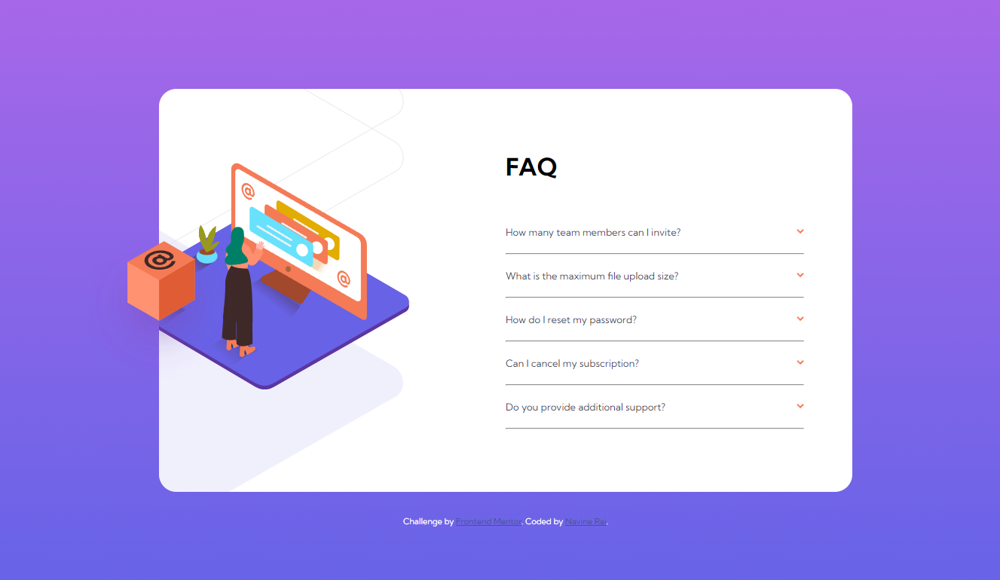

# Frontend Mentor - FAQ accordion card solution

This is a solution to the [FAQ accordion card challenge on Frontend Mentor](https://www.frontendmentor.io/challenges/faq-accordion-card-XlyjD0Oam). Frontend Mentor challenges help you improve your coding skills by building realistic projects. 

## Table of contents

- [Overview](#overview)
  - [The challenge](#the-challenge)
  - [Screenshot](#screenshot)
  - [Links](#links)
- [My process](#my-process)
  - [Built with](#built-with)
  - [What I learned](#what-i-learned)
  - [Continued development](#continued-development)
  - [Useful resources](#useful-resources)
- [Author](#author)

## Overview

### The challenge

Users should be able to:

- View the optimal layout for the component depending on their device's screen size
- See hover states for all interactive elements on the page
- Hide/Show the answer to a question when the question is clicked

### Screenshot

### Links

- Solution URL: [Add solution URL here](https://your-solution-url.com)
- Live Site URL: [Add live site URL here](https://your-live-site-url.com)

## My process

### Built with

- Semantic HTML5 markup
- CSS custom properties
- Flexbox
- CSS Grid
- Mobile-first workflow

### What I learned

The biggest thing I had the opportunity to practice with this project was using CSS Grid for laying out images and overlapping them. Both the mobile and desktop versions had images that laid on top of each other (the orange box, the person at the screen, and the shadow), and CSS Grid provides a way to achieve this without taking elements out of the document flow.

### Continued development

For continued development I would like to refactor some of the html so that the orange box can be out of the overflow:hidden heirarchy and placed properly without having to use position: fixed.

### Useful resources

- [CSS Grid Blogpost](https://bricampgomez.com/blog/how-to-overlap-images-in-css/) - This post was helpful in understanding how grid can be used to overlap images.

## Author

- Frontend Mentor - [@rainSax](https://www.frontendmentor.io/profile/rainSax)
